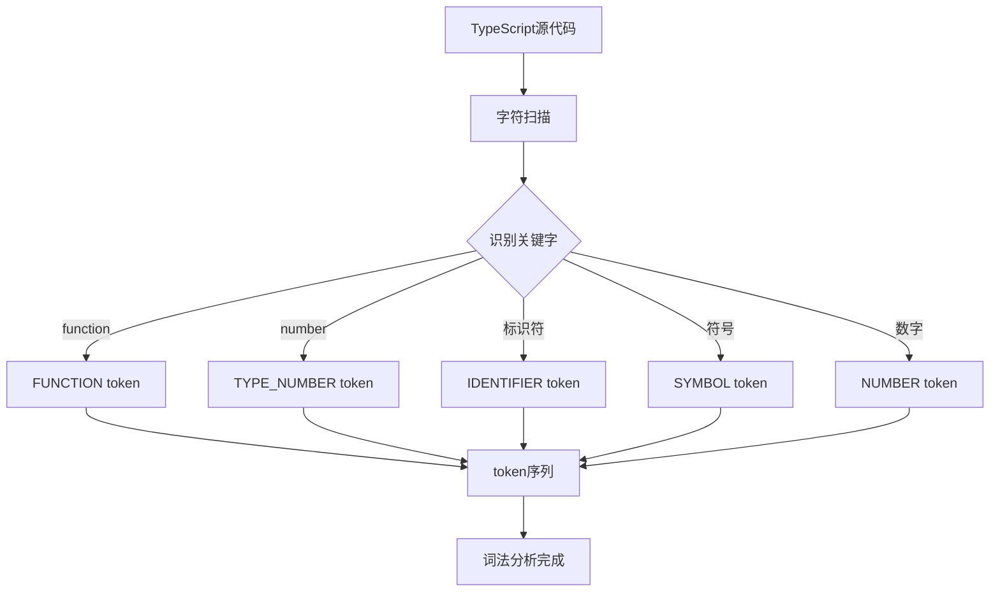
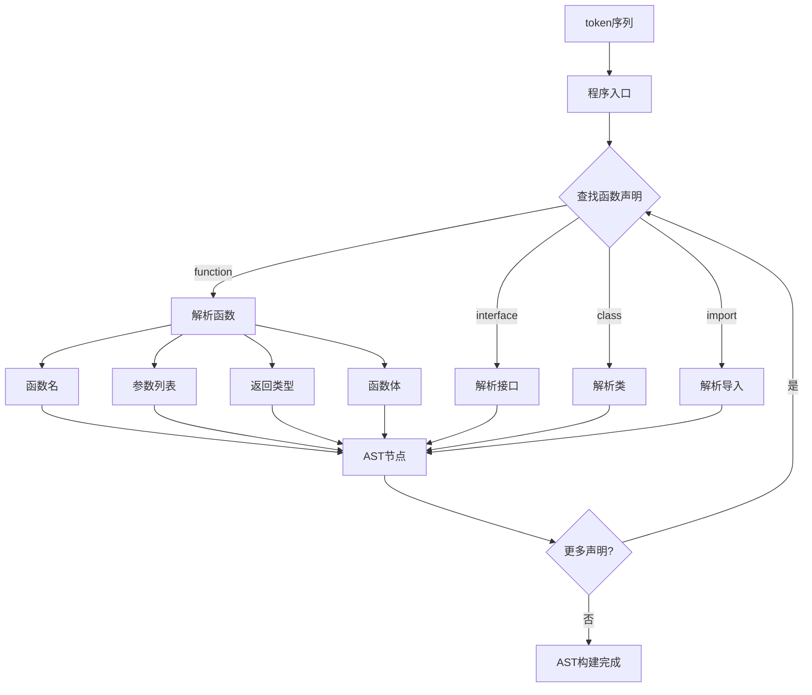
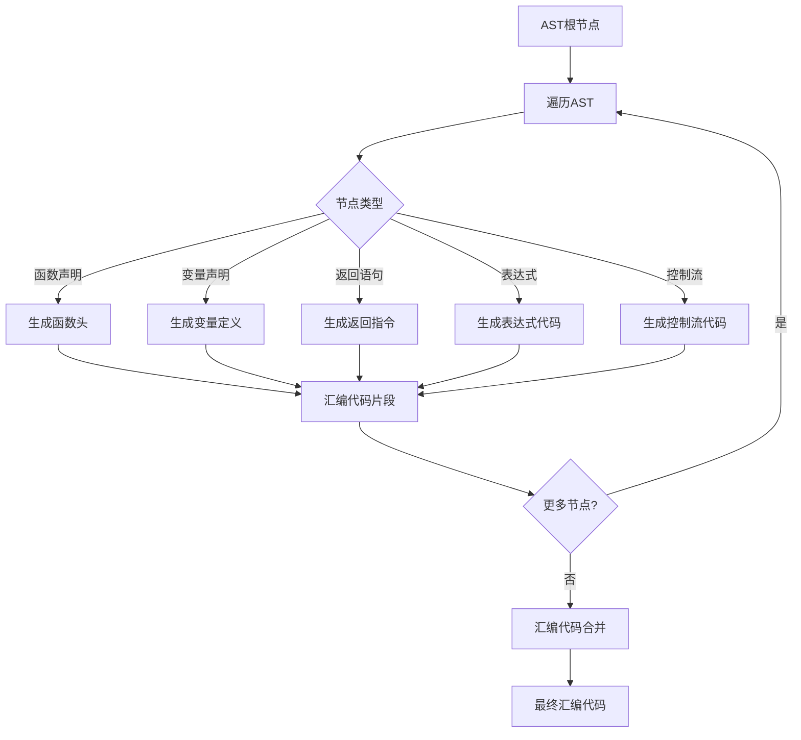
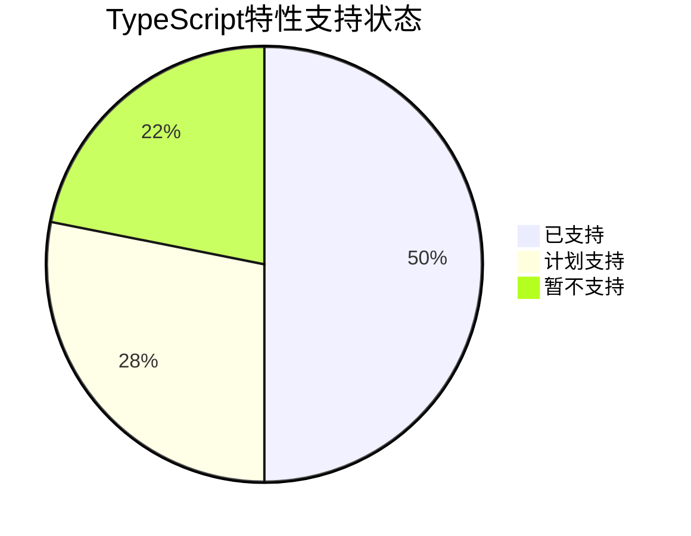
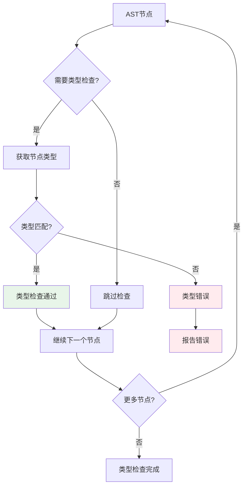
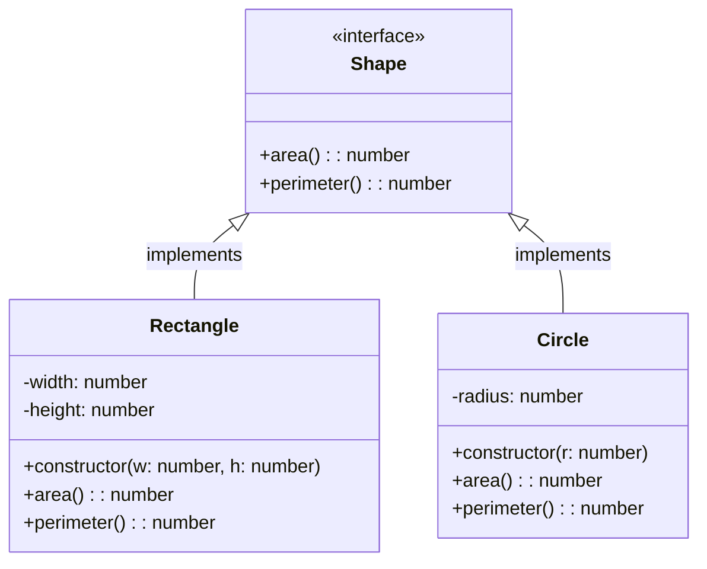
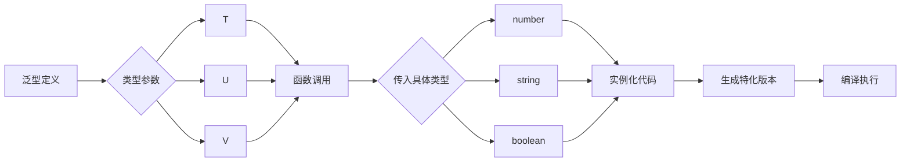

# Mini-TS - TypeScript 编译器示例

Mini-TS 是一个使用 Gaia 汇编器前端构建的 TypeScript 子集编译器示例，展示了如何将 TypeScript 风格的语法编译为 Gaia 汇编代码。

## 🎯 项目概述

Mini-TS 实现了 TypeScript 语言的核心特性子集，包括：

- 函数声明和表达式
- 变量声明和类型注解
- 基本数据类型（number, string, boolean）
- 箭头函数和普通函数
- 接口定义（基础）
- 类定义（基础）
- 泛型（基础）
- 模块系统（基础）

## 🚀 快速开始

### 环境要求

- Node.js 18.0 或更高版本
- TypeScript 编译器
- Gaia WASM32 前端包

### 安装依赖

```bash
# 在项目目录
cd examples/mini-ts

# 安装依赖
npm install

# 构建项目
npm run build
```

### 基本使用

```bash
# 编译 TypeScript 文件
npm start test/example.ts

# 或者使用构建后的版本
node dist/index.js test/example.ts

# 开发模式
npm run dev test/example.ts
```

## 📁 项目结构

```
mini-ts/
├── src/                    # 源代码目录
│   ├── index.ts           # 主入口文件
│   ├── lexer.ts           # 词法分析器
│   ├── parser.ts          # 语法分析器
│   ├── ast.ts             # 抽象语法树定义
│   ├── codegen.ts         # 代码生成器
│   └── lib.ts             # 主库文件
├── tests/                 # 测试文件
│   ├── compiler.test.ts   # 编译器测试
│   ├── test.mts           # 测试 TypeScript 文件
│   └── example.ts         # 示例 TypeScript 文件
├── dist/                  # 构建输出目录
├── node_modules/          # 依赖包
├── package.json           # 包配置
├── tsconfig.json          # TypeScript 配置
├── vitest.config.ts       # 测试配置
└── readme.md              # 本文档
```

## 🔧 核心组件

### 1. 词法分析器 (Lexer)

将 TypeScript 源代码分解为词法单元（tokens）：

```typescript
// 输入源代码
function add(a: number, b: number): number {
    return a + b;
}

// 输出的 tokens
[
    { type: 'FUNCTION', value: 'function' },
    { type: 'IDENTIFIER', value: 'add' },
    { type: 'LPAREN', value: '(' },
    { type: 'IDENTIFIER', value: 'a' },
    { type: 'COLON', value: ':' },
    { type: 'TYPE_NUMBER', value: 'number' },
    { type: 'COMMA', value: ',' },
    { type: 'IDENTIFIER', value: 'b' },
    { type: 'COLON', value: ':' },
    { type: 'TYPE_NUMBER', value: 'number' },
    { type: 'RPAREN', value: ')' },
    { type: 'COLON', value: ':' },
    { type: 'TYPE_NUMBER', value: 'number' },
    { type: 'LBRACE', value: '{' },
    { type: 'RETURN', value: 'return' },
    { type: 'IDENTIFIER', value: 'a' },
    { type: 'PLUS', value: '+' },
    { type: 'IDENTIFIER', value: 'b' },
    { type: 'SEMICOLON', value: ';' },
    { type: 'RBRACE', value: '}' }
]
```

**词法分析流程图：**



### 2. 语法分析器 (Parser)

将词法单元解析为抽象语法树（AST）：

```typescript
interface Program {
    functions: FunctionDeclaration[];
    interfaces?: InterfaceDeclaration[];
    classes?: ClassDeclaration[];
    imports?: ImportDeclaration[];
}

interface FunctionDeclaration {
    name: string;
    parameters: Parameter[];
    returnType?: TypeAnnotation;
    body: Statement[];
    isArrow?: boolean;
}
```

**语法分析流程图：**



### 3. 抽象语法树 (AST)

定义了 TypeScript 语言结构的数据结构：

```typescript
// 语句类型
interface Statement {
    type: 'var_decl' | 'function_decl' | 'interface_decl' | 'class_decl' | 
           'return' | 'if' | 'for' | 'while' | 'expression';
}

// 表达式类型
interface Expression {
    type: 'identifier' | 'literal' | 'binary_op' | 'function_call' | 
           'arrow_function' | 'member_access' | 'array_access';
}
```

### 4. 代码生成器 (CodeGen)

将 AST 转换为 Gaia 汇编代码：

```typescript
// TypeScript 源代码
function multiply(x: number, y: number): number {
    return x * y;
}

// 生成的 Gaia 汇编代码
function multiply: (number, number) -> number {
    load.local x
    load.local y
    multiply.number
    return
}
```

**代码生成流程图：**



## 🧪 示例代码

### 基础函数

```typescript
// 示例函数
function greet(name: string): string {
    return `Hello, ${name}!`;
}

// 箭头函数
const add = (a: number, b: number): number => a + b;

// 泛型函数
function identity<T>(value: T): T {
    return value;
}
```

### 接口定义

```typescript
interface Person {
    name: string;
    age: number;
    greet(): string;
}
```

### 类定义

```typescript
class Calculator {
    private result: number = 0;
    
    add(value: number): void {
        this.result += value;
    }
    
    getResult(): number {
        return this.result;
    }
}
```

## 🛠️ 开发指南

### 编译流程总览

```mermaid
flowchart LR
    A[TypeScript源码] --> B[词法分析器]
    B --> C[Token序列]
    C --> D[语法分析器]
    D --> E[AST抽象语法树]
    E --> F[类型检查器]
    F --> G[类型验证后的AST]
    G --> H[代码生成器]
    H --> I[Gaia汇编代码]
    I --> J[Gaia汇编器]
    J --> K[可执行代码]
    
    style A fill:#e1f5fe
    style E fill:#f3e5f5
    style I fill:#e8f5e8
    style K fill:#fff3e0
```



### 运行测试

```bash
# 运行所有测试
npm test

# 运行测试并监视文件变化
npm run test:watch

# 打开测试 UI
npm run test:ui

# 生成测试覆盖率报告
npm run coverage
```

### 开发模式

```bash
# 使用 ts-node 直接运行 TypeScript 代码
npm run dev test/example.ts
```

## 📋 支持的 TypeScript 特性

### ✅ 已支持

- 函数声明 (`function name() {}`)
- 箭头函数 (`const fn = () => {}`)
- 类型注解 (`let x: number = 10`)
- 基本数据类型 (`number`, `string`, `boolean`)
- 数学运算 (`+`, `-`, `*`, `/`, `%`)
- 逻辑运算 (`&&`, `||`, `!`)
- 比较运算 (`==`, `!=`, `<`, `>`, `<=`, `>=`)
- 位运算 (`&`, `|`, `^`, `<<`, `>>`)
- 控制流 (`if`, `for`, `while`)
- 函数调用
- 递归函数
- 常量声明 (`const PI = 3.14`)
- 接口定义（基础）
- 类定义（基础）
- 泛型（基础）
- 模块导入/导出（基础）

**特性支持状态图：**



### 🚧 计划支持

- 枚举类型
- 联合类型
- 交叉类型
- 类型守卫
- 装饰器
- 异步函数（async/await）
- Promise 处理
- 命名空间
- 模块声明合并

### ❌ 暂不支持

- 高级类型操作
- 条件类型
- 映射类型
- 模板字面量类型
- 可变参数元组
- 递归类型别名
- JSX 支持

## 🔗 与 Gaia 集成

Mini-TS 使用 `@nyar/gaia-assembler-wasm32` 包来调用 Gaia 汇编器：

```typescript
import { Assembler, Metadata, Utils } from '@nyar/gaia-assembler-wasm32';

// 创建汇编器实例
const assembler = new Assembler();

// 编译生成的汇编代码
const result = assembler.compile(assemblyCode);

// 处理编译结果
if (result.success) {
    console.log('TypeScript compilation successful!');
    // 处理生成的程序
}
```

**集成架构图：**

```mermaid
flowchart TB
    subgraph "Mini-TS 编译器"
        A[TypeScript源码] --> B[编译器核心]
        B --> C[Gaia汇编代码]
    end
    
    subgraph "Gaia WASM32 前端"
        C --> D[@nyar/gaia-assembler-wasm32]
        D --> E[汇编器实例]
        E --> F[编译结果]
    end
    
    subgraph "Node.js 环境"
        F --> G[JavaScript对象]
        G --> H[控制台输出]
        G --> I[文件写入]
        G --> J[网络传输]
    end
    
    style A fill:#e3f2fd
    style C fill:#e8f5e9
    style F fill:#fff3e0
```

## 🎯 TypeScript 特色功能

### 类型系统

Mini-TS 实现了基础的 TypeScript 类型系统：

```typescript
// 类型注解
let count: number = 42;
let message: string = "Hello";
let isActive: boolean = true;

// 函数类型
function processData(data: string[]): number {
    return data.length;
}
```

**类型检查流程图：**



### 接口和类

```typescript
// 接口定义
interface Shape {
    area(): number;
    perimeter(): number;
}

// 类实现
class Rectangle implements Shape {
    constructor(private width: number, private height: number) {}
    
    area(): number {
        return this.width * this.height;
    }
    
    perimeter(): number {
        return 2 * (this.width + this.height);
    }
}
```

**类继承关系图：**



### 泛型支持

```typescript
// 泛型函数
function first<T>(items: T[]): T {
    return items[0];
}

// 泛型类
class Container<T> {
    private value: T;
    
    constructor(value: T) {
        this.value = value;
    }
    
    getValue(): T {
        return this.value;
    }
}
```

**泛型实例化流程图：**



## 📄 许可证

本项目采用 MIT 许可证，详见项目根目录的 [License.md](../../License.md) 文件。

## 🤝 贡献

欢迎贡献代码！您可以：

1. 添加新的 TypeScript 语言特性支持
2. 改进类型检查器
3. 优化代码生成器
4. 添加更多测试用例
5. 改进文档和示例
6. 添加语言服务支持（智能提示等）

## 📚 学习资源

- **[TypeScript 官方文档](https://www.typescriptlang.org/docs/)**: TypeScript 官方文档
- **[TypeScript 语言规范](https://github.com/microsoft/TypeScript/blob/main/doc/spec.md)**: TypeScript 语言规范
- **[Gaia 汇编器文档](https://docs.rs/gaia-frontend)**: Gaia 汇编器 API 文档
- **[编译器设计](https://craftinginterpreters.com/)**: 编译器设计原理
- **[TypeScript 编译器源码](https://github.com/microsoft/TypeScript)**: TypeScript 编译器源码

---

**Mini-TS** - 学习 TypeScript 编译器和 Gaia 汇编器的现代化示例！